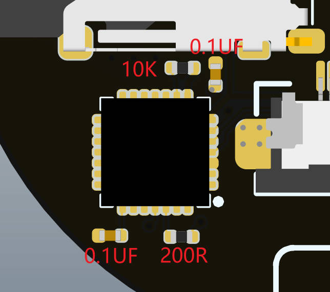

## 2022/11/26更新

主板电阻电容增大间距，不易连锡；

CP2102兼容了[CH9102X](https://item.taobao.com/item.htm?spm=a230r.1.14.6.1bea68c9lNiSzG&id=675981384914&ns=1&abbucket=11#detail) 这个便宜一点；如果装CP2102左下角的0.1UF可不焊。

ServoDrive：

增加SensorBoardConnecter和ServoDriveConnecter 可以将舵机转FPC连接  （可选项，不需要打也行）

# 2022/7/24更新

ServoDrive增加5v入口10uF电容焊盘  有效解决舵机断联问题

********************************************************************************************************************

ServoDrive 增大了烧录焊盘 和 4p连接线焊盘

ElectronBot主板把焊盘上的过孔移到焊盘外了、3300好焊很多
